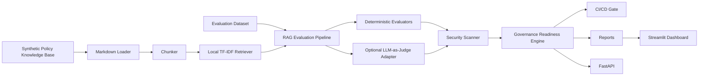

# Architecture

The platform is offline-first. It generates synthetic policy documents and synthetic test cases, retrieves local context, evaluates RAG answers, scans for injection and sensitive-data risks, and produces governance artifacts. OpenAI usage is optional and only activated through environment variables.

## Key Design Choices

- Deterministic evaluators are the default so CI can run without paid APIs.
- Provider adapters isolate model calls from scoring, reports, and gates.
- Ollama support enables free local `LLM Generated` mode when a local model server is running.
- File-based storage keeps the portfolio project easy to run locally.
- Reports are split between `reports/generated/` for reruns and `reports/sample/` for committed examples.
- Fairness is framed as readiness review because real fairness measurement requires appropriate slice data.
